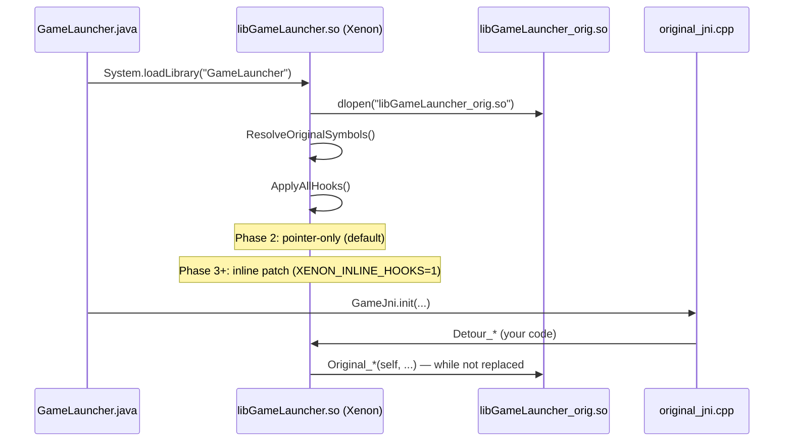

# PvZ-Xenon: Hook System & Decompilation Replacement Guide

**Reference APK (Java):** `decompiled/smali/` (apktool output of `com.trans.pvz`)  
**Game engine (C++):** `libGameLauncher_orig.so` (`armeabi-v7a`)

---

## Core Philosophy

The goal is **not** to patch the original binary permanently.  
The strategy is to replace the game function by function:

```
Phase 1 — Original runs alone
  libGameLauncher_orig.so  ←  entire game runs here

Phase 2 — Xenon intercepts (hooks active)
  libGameLauncher_orig.so  ←  executes everything
       ↑ detour               ↑ trampoline calls original
  libGameLauncher.so (Xenon)  ←  intercepts, logs, delegates

Phase 3 — Function-by-function replacement
  Detour_Board_Update()  →  NO longer calls Original_Board_Update
                         →  runs your clean reconstructed C++
  (the rest still calls the original)

Phase 4 — Original .so eliminated
  libGameLauncher.so contains ALL native code
  libGameLauncher_orig.so deleted from APK
```

Each `Detour_*` starts by calling `Original_*` and progressively transitions into the real implementation. This ensures the game never breaks during the reconstruction process.

---

## Table of contents

1. [File Structure](#1-file-structure)
2. [Execution Flow](#2-execution-flow)
3. [Hook Lifecycle](#3-hook-lifecycle)
4. [Step-by-step: Adding a New Hook](#4-step-by-step-adding-a-new-hook)
5. [Step-by-step: Promoting to Clean Replacement](#5-step-by-step-promoting-to-clean-replacement)
6. [Hook Modes: Pointer-only vs Inline Patch](#6-hook-modes-pointer-only-vs-inline-patch)
7. [Itanium ABI Name Mangling](#7-itanium-abi-name-mangling)
8. [Exporting Symbols from the .so](#8-exporting-symbols-from-the-so)
9. [Full IDA Pro / Ghidra Workflow](#9-full-ida-pro--ghidra-workflow)
10. [Engine Types Reference — sexy_types.h](#10-engine-types-reference--sexy_typesh)
11. [JNI Debugging & Logcat](#11-jni-debugging--logcat)
12. [ARM Thumb — Gotchas & Internals](#12-arm-thumb--gotchas--internals)
13. [arm32_hook Internals](#13-arm32_hook-internals)
14. [Currently Registered Hooks](#14-currently-registered-hooks)
15. [Common Reconstruction Mistakes](#15-common-reconstruction-mistakes)
16. [Troubleshooting](#16-troubleshooting)

---

## 1. File Structure

```
app/src/main/cpp/xenon/
│
├── core/
│   ├── hook.h / hook.cpp          # RegisterHook, ApplyAllHooks, RemoveAllHooks, GetRegisteredHooks
│   ├── arm32_hook.h / .cpp        # Arm32Hook::Install / Remove — inline patch + mmap trampoline
│   ├── xenon.h / xenon.cpp        # Initialize, dlopen _orig.so, ResolveOriginalMainSymbol
│   └── logger.h                   # LOGV/LOGD/LOGI/LOGW/LOGE → logcat tag "Xenon"
│
├── original/
│   ├── original_symbols.h         # extern function pointers: Coin_IsSun, Board_Update, etc.
│   ├── original_symbols.cpp       # dlsym("_ZN...") for each symbol via ResolveOriginalSymbols()
│   ├── original_jni.h
│   └── original_jni.cpp           # 24 JNI methods that delegate to the original .so
│
├── reconstructed/
│   ├── reconstructed_symbols.h    # Detour_* declarations + Original_* trampolines
│   └── reconstructed_symbols.cpp  # Implementations: Phase 2 (delegate) / Phase 3 (clean code)
│
├── hooks/
│   └── hook_registry.cpp          # RegisterIfResolved() for each hooked function
│
└── sexy/
    └── sexy_types.h               # Engine types: Sexy::Color, TRect, Board*, Zombie*, Plant*, etc.
```

**Rule:** A hooked function touches **4 files**:
`original_symbols` → `reconstructed_symbols` → `hook_registry` → build

---

## 2. Execution Flow



---

## 3. Hook Lifecycle

Every function goes through these states:

| State | Description | Code in `Detour_*` |
|-------|-------------|----------------------|
| **DELEGATED** | Intercepts, logs, calls original | `return Original_Func(self, ...)` |
| **MIXED** | Your logic for specific cases, original for the rest | `if (cond) { ... } else { return Original_*(self,...); }` |
| **REPLACED** | Does not call original, you implement everything | `// Original_* is no longer used` |
| **ELIMINATED** | Original .so doesn't exist, entirely standalone | `// libGameLauncher_orig.so deleted` |

Always start in **DELEGATED**. Advance only when you are confident in your implementation.

---

## 4. Step-by-step: Adding a New Hook

Example: `Board::CanPlantAt(int, int)` → mangled: `_ZN5Board10CanPlantAtEii`

### Step 1 — `original/original_symbols.h`

```cpp
class Board;  // forward declaration
extern bool (*Board_CanPlantAt)(Board* self, int gridX, int gridY);
```

### Step 2 — `original/original_symbols.cpp`

Inside `ResolveOriginalSymbols()`:

```cpp
Board_CanPlantAt = (bool(*)(Board*, int, int))
    ResolveOriginalMainSymbol("_ZN5Board10CanPlantAtEii");
```

### Step 3 — `reconstructed/reconstructed_symbols.h`

```cpp
namespace Reconstructed {
    extern bool (*Original_Board_CanPlantAt)(Board* self, int x, int y);
    bool Detour_Board_CanPlantAt(Board* self, int x, int y);
}
```

### Step 4 — `reconstructed/reconstructed_symbols.cpp`

**Phase 2 (Delegate — starting point):**

```cpp
bool (*Reconstructed::Original_Board_CanPlantAt)(Board*, int, int) = nullptr;

bool Reconstructed::Detour_Board_CanPlantAt(Board* self, int x, int y) {
    // TODO: replace with clean implementation in Phase 3
    LOGD("Board::CanPlantAt(%d, %d)", x, y);
    return Original_Board_CanPlantAt
        ? Original_Board_CanPlantAt(self, x, y)
        : false;
}
```

### Step 5 — `hooks/hook_registry.cpp`

```cpp
RegisterIfResolved("Board::CanPlantAt",
    (void*)Original::Board_CanPlantAt,
    (void*)Reconstructed::Detour_Board_CanPlantAt,
    (void**)&Reconstructed::Original_Board_CanPlantAt);
```

### Step 6 — Build and Verify

```powershell
gradle assembleDebug
adb logcat -s Xenon
# Expect to see:
# [POINTER ONLY] Hook 'Board::CanPlantAt'
# Detour_Board_CanPlantAt(3, 2)
```

---

## 5. Step-by-step: Promoting to Clean Replacement

When you fully understand the function:

1. **Write the implementation** in `Detour_Board_CanPlantAt` without calling `Original_*`
2. **Test** on emulator/device ensuring identical behavior
3. **Mark the hook** with a comment `// STATUS: REPLACED`
4. When **all** functions are REPLACED → remove `_orig.so` from the APK

```cpp
// STATUS: REPLACED — no longer delegates to original
bool Reconstructed::Detour_Board_CanPlantAt(Board* self, int x, int y) {
    if (x < 0 || x >= self->mNumCols) return false;
    if (y < 0 || y >= self->mNumRows) return false;
    // ... real reconstructed logic
    return self->mGrid[x][y].mPlant == nullptr;
}
```

---

## 6. Hook Modes: Pointer-only vs Inline Patch

The hook engine has two modes controlled by an environment variable:

| Mode | Trigger | When to use |
|------|---------|-------------|
| **Pointer-only** (default) | `XENON_INLINE_HOOKS` not set or ≠ `"1"` | BlueStacks, libhoudini, x86 emulators. Does not patch memory, only adjusts pointers. Safe. |
| **Inline patch** | `XENON_INLINE_HOOKS=1` | Real ARM hardware (Snapdragon, MediaTek). 8/12 byte patch in the prologue. |

In **pointer-only**, `Original_*` points directly to the function in the original `.so`.  
The `Detour_*` will **not** automatically intercept internal calls from the `.so` (only JNI and calls passing through your pointer).

In **inline patch**, the prologue of the real function is replaced with a jump to your detour. This intercepts **all** calls, including internal ones.

> ⚠️ `Board::Update`, `Zombie::Update`, `Plant::Update` and similar per-frame functions are **unregistered** from the hook_registry because inline patching such frequent functions causes SIGSEGV on libhoudini. Only add them on real ARM with `XENON_INLINE_HOOKS=1`.

---

## 7. Itanium ABI Name Mangling

| C++ Source | Mangled |
|---------------|---------|
| `void Board::Update()` | `_ZN5Board6UpdateEv` |
| `void Board::AddSun(int)` | `_ZN5Board6AddSunEi` |
| `bool Coin::IsSun()` | `_ZN4Coin5IsSunEv` |
| `bool Board::CanPlantAt(int,int)` | `_ZN5Board10CanPlantAtEii` |
| `void Zombie::Update()` | `_ZN6Zombie6UpdateEv` |
| `void Plant::Update()` | `_ZN4Plant6UpdateEv` |
| `void LawnApp::UpdateApp()` | `_ZN7LawnApp9UpdateAppEv` |
| `void Board::DrawHouseDoorBottom(Graphics*)` | `_ZN5Board19DrawHouseDoorBottomEPN4Sexy8GraphicsE` |
| `Sexy::Image* Sexy::ImageLib::GetImage(const std::string&)` | `_ZN4Sexy8ImageLib8GetImageERKSs` |
| `void LawnApp::KillGame()` | `_ZN7LawnApp8KillGameEv` |

**Pattern:** `_ZN` + length + class name + length + method name + `E` + arg types (`v`=void, `i`=int, `b`=bool, `P`=pointer, `R`=reference, `K`=const)

**Argument Type Cheat Sheet:**

| C++ Type | ABI Code |
|----------|-----------|
| `void` | `v` |
| `int` | `i` |
| `unsigned int` | `j` |
| `float` | `f` |
| `double` | `d` |
| `bool` | `b` |
| `char` | `c` |
| `short` | `s` |
| `long` | `l` |
| `long long` | `x` |
| `T*` | `PT` |
| `const T*` | `PKT` |
| `T&` | `RT` |
| `const std::string&` | `RKSs` |

**Quick Demangle:**
```powershell
& "$env:LOCALAPPDATA\Android\Sdk\ndk\25.1.8937393\toolchains\llvm\prebuilt\windows-x86_64\bin\llvm-cxxfilt.exe" _ZN5Board6AddSunEi
# → Board::AddSun(int)
```

Or with `readelf`:
```powershell
llvm-readelf --syms app\src\main\jniLibs\armeabi-v7a\libGameLauncher_orig.so | findstr "Board"
```

---

## 8. Exporting Symbols from the .so

```powershell
cd C:\Users\nydil\source\repos\PvZ-Xenon
.\scripts\export_game_symbols.ps1
# → build\libGameLauncher_symbols.txt
```

Manual:
```powershell
# All exported symbols
llvm-nm -g --defined-only app\src\main\jniLibs\armeabi-v7a\libGameLauncher_orig.so | findstr "_ZN5Board"

# Only functions (T = code section)
llvm-nm -g --defined-only app\src\main\jniLibs\armeabi-v7a\libGameLauncher_orig.so `
    | Where-Object { $_ -match " T " } `
    | ForEach-Object { ($_ -split " ")[-1] }
```

> **ARM Thumb Note:** If the symbol in `nm` ends in an odd address (e.g., `00012345 T _ZN...`), the function is **Thumb**. The engine uses almost 100% Thumb2. See section §12.

---

## 9. Full IDA Pro / Ghidra Workflow

### Opening the .so in IDA

1. `File → Open` → select `libGameLauncher_orig.so`
2. Architecture: **ARM**, mode: **Little Endian**, ABI: **32-bit**
3. Wait for auto-analysis (~2-5 min for this binary)
4. `View → Open subviews → Functions` to see all functions

### Finding the function you want to hook

```
# Option A — search by mangled name (if exported)
IDA: Ctrl+L → paste "_ZN5Board6AddSunEi"

# Option B — search by internal log string
IDA: Alt+T (Text search) → "AddSun" → finds the log inside the function

# Option C — from smali (which JNI calls what)
decompiled/smali/com/trans/GameView$Renderer.smali → search "invoke-static"
→ identify which GameJni.* is called → trace in original_jni.cpp
→ that JNI calls Original_* → which is the address in the .so
```

### Reading IDA's pseudocode

IDA's pseudocode is a **hint**, not compile-ready code:

- `_DWORD *` → likely `Board*` or a class type
- `this` is the first parameter in C++ (`Board* self`)
- Inlined STL types appear as raw pointer operations
- `*((_DWORD *)this + 42)` → field at offset `42 * 4 = 0xA8` → maps to `mBoard->mField` in `sexy_types.h`
- `LOBYTE(v3)` → cast to `(uint8_t)` or `bool` field
- `sub_XXXXXX` without a name → internal function, needs manual identification

### Mapping offsets to struct fields

The correct workflow is:

1. **In IDA:** `Ctrl+X` on `this` to see all field accesses
2. **Sort by offset:** gives the complete map of the structure
3. **Cross-reference with Ghidra:** Ghidra sometimes names STL types better
4. **Update `sexy_types.h`** with discovered offsets

Mapping example:

```cpp
// IDA pseudocode:
// if ( *(_DWORD *)(this + 0x1C) > 50 ) { ... }
//
// In sexy_types.h you add:
struct Board {
    // offset 0x00 — vtable ptr
    // offset 0x04 — LawnApp* mApp
    // ...
    // offset 0x1C — int mSunCount  ← new discovery
};
```

### Verifying with logcat

```cpp
// In your Detour_*, temporarily add:
LOGD("Board::AddSun — mSunCount before = %d", self->mSunCount);
Original_Board_AddSun(self, amount);
LOGD("Board::AddSun — mSunCount after  = %d", self->mSunCount);
```

```powershell
adb logcat -s Xenon | findstr "AddSun"
```

**Recommended Workflow:**
1. Copy the pseudocode as a comment in `reconstructed_symbols.cpp`
2. Identify real types using `sexy_types.h` and the smali in `decompiled/`
3. Write the clean equivalent in modern C++
4. The Detour starts calling `Original_*` → replace block by block
5. Use `LOGD` to verify values in each iteration

---

## 10. Engine Types Reference — sexy_types.h

`sexy_types.h` declares the PopCap engine types. Here are the most important ones:

```cpp
// sexy/sexy_types.h

namespace Sexy {
    // Renderer — the game's GL context
    class Graphics {
        // +0x00 void* mDDInterface   (DirectDraw/GL interface)
        // +0x04 int mWidth
        // +0x08 int mHeight
        // +0x0C int mTransX          (accumulated translation X)
        // +0x10 int mTransY
        // +0x14 float mScaleX
        // +0x18 float mScaleY
        // +0x1C Color mColor         (current renderer ARGB)
        void DrawImage(Image* img, int x, int y);
        void DrawImageF(Image* img, float x, float y);
        void SetColor(int argb);
        void SetColorizeImages(bool);
    };

    class Image {
        // +0x00 void* mTexture       (wrapped GL texture id)
        // +0x04 int mWidth
        // +0x08 int mHeight
        // +0x0C int mNumCols         (sprite sheet cols)
        // +0x10 int mNumRows
    };

    struct Color {
        int mRed, mGreen, mBlue, mAlpha;  // 0–255 each
    };
}

// Top-level app
class LawnApp {
    // +0x00 vtable
    // +0x04 Sexy::WidgetManager* mWidgetManager
    // +0x08 Board* mBoard
    // +0x0C bool mDemoMode
};

class Board {
    // +0x00 vtable
    // +0x04 LawnApp* mApp
    // +0x08 int mLevel
    // +0x0C int mSunCount
    // +0x10 int mNumCols  (lawn columns, usually 9)
    // +0x14 int mNumRows  (lawn rows, usually 5 or 6)
    // +0x18 GridItem mGrid[mNumCols][mNumRows]
};

class Zombie {
    // +0x00 vtable
    // +0x04 Board* mBoard
    // +0x08 int mZombieType   (ZombieType enum)
    // +0x0C float mX
    // +0x10 float mY
    // +0x14 int mHP
    // +0x18 int mMaxHP
    // +0x1C bool mDead
};

class Plant {
    // +0x00 vtable
    // +0x04 Board* mBoard
    // +0x08 int mPlantType    (SeedType enum)
    // +0x0C int mGridX
    // +0x10 int mGridY
    // +0x14 int mHP
    // +0x18 bool mDead
    // +0x1C int mState        (PlantState enum)
};

class Coin {
    // +0x00 vtable
    // +0x04 Board* mBoard
    // +0x08 int mCoinType     (CoinType: COIN_SUN=0, COIN_COIN=1, COIN_DIAMOND=2)
    // +0x0C float mX
    // +0x10 float mY
    // +0x14 int mSunValue     (only valid if mCoinType == COIN_SUN)
    // +0x18 bool mCollected
    bool IsSun();   // hooked — see §14
};
```

> ⚠️ Offsets are approximations. **Always verify with IDA** before using them in real reconstruction.  
> An incorrect offset causes silent memory corruption and non-deterministic crashes.

---

## 11. JNI Debugging & Logcat

### Most Useful Logcat Filters

```powershell
# Only hook system messages
adb logcat -s Xenon

# Hooks + JNI crashes
adb logcat -s Xenon AndroidRuntime

# Entire game (verbose)
adb logcat -s Xenon GameView GameActivity Render ACPManager

# Detect freeze: see if GLThread stops logging
adb logcat -s Render | Measure-Object -Line   # count lines per second

# Native crash stack trace
adb logcat | findstr -i "SIGSEGV\|signal\|fault addr\|pc "
```

### Injecting Logs into Critical Functions

```cpp
// In Detour_*, always use LOGD to avoid polluting release builds:
LOGD(">>> Board::Update() — frame=%d sun=%d", mFrameCount, self->mSunCount);
```

Available macros in `logger.h`:

| Macro | Android Level | Use |
|-------|--------------|-----|
| `LOGV(...)` | VERBOSE | Very verbose traces (per-frame) |
| `LOGD(...)` | DEBUG | Normal debugging |
| `LOGI(...)` | INFO | Important events |
| `LOGW(...)` | WARN | Unexpected but non-fatal conditions |
| `LOGE(...)` | ERROR | Severe errors |

### Detecting if a Hook Applied

```powershell
adb logcat -s Xenon | findstr "Hook"
# Expected output:
# [POINTER ONLY] Hook 'Board::CanPlantAt' @ 0xb4001234
# [INLINE PATCH]  Hook 'Coin::IsSun'      @ 0xb4005678
# Hook skipped (symbol missing): 'Board::NonExistentFn'
```

### Verifying if the Original .so Loaded Correctly

```powershell
adb logcat -s Xenon | findstr "dlopen\|orig\|Resolve"
# Expected output:
# dlopen("libGameLauncher_orig.so") OK — handle=0xdeadbeef
# ResolveOriginalSymbols: 24/24 JNI symbols resolved
# ResolveOriginalSymbols: 8/8 hook symbols resolved
```

---

## 12. ARM Thumb — Gotchas & Internals

The original `.so` uses almost exclusively **Thumb-2** (intermixed 16/32-bit instructions). This affects hooking:

### Identifying Thumb vs ARM

```
# In nm/readelf: ODD addresses = Thumb
00012345 T _ZN5Board6UpdateEv    ← odd → Thumb
00012344 T _ZN5Board6UpdateEv    ← even → ARM (rare in this .so)
```

In IDA, the bottom bar says `"THUMB"` when you select a Thumb instruction.

### How it affects Inline Patching

- Thumb uses **16 or 32-bit** instructions (mixed), not fixed 32-bit like ARM.
- A 4-byte patch can cut a 4-byte instruction in half → SIGILL.
- `arm32_hook.cpp` handles this: detects Thumb via the odd address and generates the appropriate trampoline.

### Common Thumb Reconstruction Traps

```cpp
// ❌ BAD: assuming sizeof(instruction) = 4
void* target = (void*)symbol_addr;  // if Thumb, the addr has bit 0 set
// use: (symbol_addr & ~1) for the real memory address
// use: (symbol_addr | 1) for BX modes that expect Thumb

// ✓ GOOD: arm32_hook does it automatically
RegisterHook(target, detour, &original);  // arm32_hook detects Thumb internally
```

### IT Blocks — Danger in Inline Patching

Thumb's `IT/ITE/ITT` instructions condition the following instructions. If your patch falls inside an IT block, the trampoline instructions will execute conditionally. IDA shows IT blocks with colors. Avoid hooking functions that open with an IT block; instead, hook them from a caller function.

---

## 13. arm32_hook Internals

The `arm32_hook.cpp` engine provides the inline hooking capability using mmap trampolines:

- `Install()`: Allocates an executable page using `mmap(PROT_READ | PROT_WRITE | PROT_EXEC)`. It copies the first 8 bytes (ARM) or 12 bytes (Thumb) from the `targetAddress` into the `backup` array. It writes the stolen instructions to the new trampoline, appending a jump back to `targetAddress + patchSize`. It then overwrites the original prologue with an absolute branch to `detourAddress` (`LDR PC, [PC, #-4]` for ARM, or equivalent Thumb sequence).
- `Remove()`: Re-protects the memory and restores the `backup` bytes over the inline patch, then unmaps the trampoline.

The trampoline address is written to `originalTrampoline`. Calling this pointer executes the stolen prologue and jumps into the remainder of the original function safely.

---

## 14. Currently Registered Hooks

| Hook | Mangled | Status |
|------|---------|--------|
| `Coin::IsSun` | `_ZN4Coin5IsSunEv` | DELEGATED |
| `Board::DrawHouseDoorBottom` | `_ZN5Board19DrawHouseDoorBottomEPN4Sexy8GraphicsE` | DELEGATED |
| `FontRes::DeleteResource` | `_ZN4Sexy15ResourceManager7FontRes14DeleteResourceEv` | DELEGATED |

**Unregistered (per-frame, real ARM only):**

| Hook | Reason |
|------|-------|
| `Board::Update` | Inline patch causes SIGSEGV on libhoudini/BlueStacks |
| `Board::AddSun` | Same |
| `LawnApp::UpdateApp` | Same |
| `Zombie::Update` | Same |
| `Plant::Update` | Same |

To enable them on real ARM: add them back to `hook_registry.cpp` and launch with `XENON_INLINE_HOOKS=1`.

---

## 15. Common Reconstruction Mistakes

### 1. Incorrect field offset → silent crash

```cpp
// ❌ BAD: assuming offset without verifying in IDA
int sun = self->mSunCount;  // if mSunCount is at another offset, you read garbage

// ✓ GOOD: verify with LOGD first in Phase 2
LOGD("ptr=%p  offset_0x0C=%d  offset_0x10=%d",
     self,
     *(int*)((char*)self + 0x0C),
     *(int*)((char*)self + 0x10));
// Then identify which changes when you add sun in the game
```

### 2. Forgetting that `this` is the first parameter

```cpp
// ARM AAPCS calling convention for C++ methods puts `this` in r0
// IDA shows it as the first implicit argument

// ❌ BAD:
bool Detour_Coin_IsSun() { ... }         // missing this

// ✓ GOOD:
bool Detour_Coin_IsSun(Coin* self) { ... }
```

### 3. Returning wrong type from a Detour

```cpp
// If the original function returns bool (1 byte) but your detour returns int,
// the ABI might place the value in a different register → undefined behavior

// ✓ GOOD: explicit cast
bool Detour_Coin_IsSun(Coin* self) {
    return (bool)Original_Coin_IsSun(self);
}
```

### 4. Race condition between GLThread and Detour

```cpp
// Board::Update runs on the GLThread. If your detour accesses UI or
// Java structs from the GLThread without synchronization → deadlock.

// ✓ GOOD: only read/write native engine fields in per-frame detours.
// To communicate with Java → use GameJni (it has its own synchronization).
```

### 5. Hook doesn't intercept internal .so calls (pointer-only)

```
Symptom: LOGD in Detour_Board_AddSun never appears even though sun is added
Cause: Board::Update calls Board::AddSun internally (relative call within .so)
       in pointer-only, that relative call jumps straight to the original, NOT your Detour
Fix A: use XENON_INLINE_HOOKS=1 on real ARM
Fix B: hook the caller function (Board::Update) and intercept from there
```

### 6. dlsym fails on compiler-inlined functions

```
Symptom: "Hook skipped (symbol missing)" for a function IDA clearly shows
Cause: the compiler inlined the function at all call sites → doesn't exist as a symbol
Fix: hook the call site(s) that call this function instead of the function itself
```

### 7. Virtual Table Dispatch Errors

```
Symptom: Calling a virtual method from a detour crashes (e.g. self->Update()).
Cause: The compiler might generate a vtable layout that differs from the original PopCap compilation.
Fix: Always verify virtual index offsets in IDA. Use explicit function pointers if the vtable gets mangled.
```

### 8. STL String Memory Layout

```
Symptom: Reading a std::string from the original engine reads garbage or crashes.
Cause: The gnustl_shared or c++_shared ABI for std::string (SSO vs heap) differs from your NDK.
Fix: Treat std::string as an opaque structure unless you perfectly match the NDK ABI used by PopCap.
```

---

## 16. Troubleshooting

| Symptom | Probable Cause | Fix |
|---------|---------------|-----|
| `Hook skipped (symbol missing)` | Incorrect mangled name | Run `export_game_symbols.ps1` and find the correct symbol |
| `[POINTER ONLY]` in logcat | Pointer-only mode active | Normal on BlueStacks. Use `XENON_INLINE_HOOKS=1` on real ARM |
| Crash in GLThread after `Board::RebuildHelpBar` | Per-frame hook with inline patch on libhoudini | Unregister the hook or use pointer-only |
| Detour never logs | Function not called in current scene, or hook not applied | Verify with `GetRegisteredHooks()` |
| `dlopen` fails | `libGameLauncher_orig.so` is not in `jniLibs/armeabi-v7a/` | Verify the original renaming was correct |
| Build error `cannot find symbol` | Missing Java import or undeclared C++ type | Verify `original_symbols.h` and Java stub imports |
| Corrupt field values reading struct | Incorrect offset | Verify offsets in IDA with `Ctrl+X` on `this` |
| SIGSEGV immediately in `ApplyAllHooks` | Inline patch in Thumb function with IT block | Do not hook this function directly; hook call site |
| Game freezes, audio continues | GLThread blocked waiting for event | Check GLThread freeze section (GameView / GLSurfaceView) |
| Semi-transparencies with visual artifacts | Android compositor applies double alpha-blend | `getWindow().setFormat(PixelFormat.OPAQUE)` in `GameActivity.onCreate` |
| Green/black texture instead of image | EGL config without alpha or wrong surface format | Verify `ConfigChooser` and `setFormat(PixelFormat.RGBA_8888)` |
