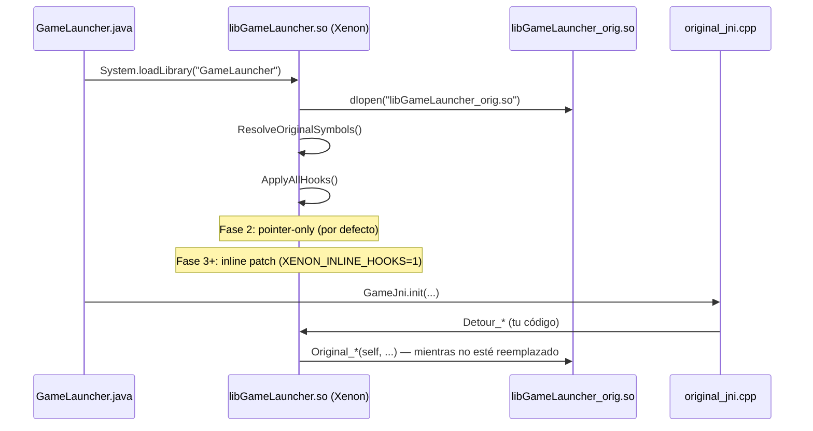

# PvZ-Xenon: Hook System & Decompilation Replacement Guide

**Reference APK (Java):** `decompiled/smali/` (apktool output of `com.trans.pvz`)  
**Game engine (C++):** `libGameLauncher_orig.so` (`armeabi-v7a`)

---

## Filosofía central

El objetivo **no** es parchear el binario original permanentemente.  
El plan es reemplazar función por función:

```
Fase 1 — Original corre solo
  libGameLauncher_orig.so  ←  todo el juego corre aquí

Fase 2 — Xenon intercepta (hooks activos)
  libGameLauncher_orig.so  ←  ejecuta todo
       ↑ detour               ↑ trampoline llama al original
  libGameLauncher.so (Xenon)  ←  intercepta, loguea, delega

Fase 3 — Reemplazo función por función
  Detour_Board_Update()  →  ya NO llama Original_Board_Update
                         →  corre tu C++ limpio reconstruido
  (el resto sigue llamando al original)

Fase 4 — Original .so eliminado
  libGameLauncher.so contiene TODO el código nativo
  libGameLauncher_orig.so eliminado del APK
```

Cada `Detour_*` empieza llamando al `Original_*` y se va convirtiendo en la implementación real progresivamente. Así nunca se rompe el juego.

---

## Table of contents

1. [Estructura de archivos](#1-estructura-de-archivos)
2. [Flujo de ejecución](#2-flujo-de-ejecución)
3. [Ciclo de vida de un hook](#3-ciclo-de-vida-de-un-hook)
4. [Cómo añadir un nuevo hook](#4-cómo-añadir-un-nuevo-hook)
5. [Cómo promover un hook a reemplazo limpio](#5-cómo-promover-un-hook-a-reemplazo-limpio)
6. [Modo pointer-only vs inline patch](#6-modo-pointer-only-vs-inline-patch)
7. [Nombres mangled (Itanium ABI)](#7-nombres-mangled-itanium-abi)
8. [Exportar símbolos del .so](#8-exportar-símbolos-del-so)
9. [Workflow completo en IDA Pro / Ghidra](#9-workflow-completo-en-ida-pro--ghidra)
10. [Tipos del engine — sexy_types.h](#10-tipos-del-engine--sexy_typesh)
11. [Depuración JNI y logcat](#11-depuración-jni-y-logcat)
12. [ARM Thumb — diferencias y trampas](#12-arm-thumb--diferencias-y-trampas)
13. [Hooks registrados actualmente](#13-hooks-registrados-actualmente)
14. [Errores comunes de reconstrucción](#14-errores-comunes-de-reconstrucción)
15. [Troubleshooting](#15-troubleshooting)

---

## 1. Estructura de archivos

```
app/src/main/cpp/xenon/
│
├── core/
│   ├── hook.h / hook.cpp          # RegisterHook, ApplyAllHooks
│   │                                 Modo pointer-only por defecto (seguro en BlueStacks)
│   │                                 Inline patch solo si XENON_INLINE_HOOKS=1
│   ├── arm32_hook.h / .cpp        # Motor de parche ARM32/Thumb + trampoline mmap
│   ├── xenon.h / xenon.cpp        # dlopen _orig.so → resolve symbols → apply hooks
│   └── logger.h                   # LOGI / LOGE / LOGD / LOGW → logcat tag "Xenon"
│
├── original/
│   ├── original_symbols.h         # extern punteros a funciones reales del .so original
│   ├── original_symbols.cpp       # dlsym("_ZN...") para cada símbolo
│   ├── original_jni.h             # declaraciones JNI proxy
│   └── original_jni.cpp           # 24 métodos JNI que delegan al .so original
│
├── reconstructed/
│   ├── reconstructed_symbols.h    # Detour_* + Original_* trampolines
│   └── reconstructed_symbols.cpp  # Implementaciones: fase 2 = log+delegar / fase 3 = código limpio
│
├── hooks/
│   └── hook_registry.cpp          # RegisterIfResolved() para cada función hookeada
│
└── sexy/
    └── sexy_types.h               # Tipos del engine: Board*, Zombie*, Coin*, Sexy::Graphics*, etc.
```

**Regla:** una función hookeada toca **4 archivos**:
`original_symbols` → `reconstructed_symbols` → `hook_registry` → build

---

## 2. Flujo de ejecución



---

## 3. Ciclo de vida de un hook

Cada función pasa por estos estados:

| Estado | Descripción | Código en `Detour_*` |
|--------|-------------|----------------------|
| **DELEGADO** | Intercepta, loguea, llama original | `return Original_Func(self, ...)` |
| **MIXTO** | Tu lógica para casos específicos, original para el resto | `if (cond) { ... } else { return Original_*(self,...); }` |
| **REEMPLAZADO** | No llama al original, tú implementas todo | `// Original_* ya no se usa` |
| **ELIMINADO** | Original .so no existe, función completamente propia | `// libGameLauncher_orig.so borrado` |

Empieza siempre en **DELEGADO**. Avanza solo cuando tengas confianza en tu implementación.

---

## 4. Cómo añadir un nuevo hook

Ejemplo: `Board::CanPlantAt(int, int)` → mangled: `_ZN5Board10CanPlantAtEii`

### Paso 1 — `original/original_symbols.h`

```cpp
class Board;  // forward declaration
extern bool (*Board_CanPlantAt)(Board* self, int gridX, int gridY);
```

### Paso 2 — `original/original_symbols.cpp`

Dentro de `ResolveOriginalSymbols()`:

```cpp
Board_CanPlantAt = (bool(*)(Board*, int, int))
    ResolveMain("_ZN5Board10CanPlantAtEii", "Board::CanPlantAt");
```

### Paso 3 — `reconstructed/reconstructed_symbols.h`

```cpp
namespace Reconstructed {
    extern bool (*Original_Board_CanPlantAt)(Board* self, int x, int y);
    bool Detour_Board_CanPlantAt(Board* self, int x, int y);
}
```

### Paso 4 — `reconstructed/reconstructed_symbols.cpp`

**Fase 2 (delegar — punto de partida):**

```cpp
bool (*Reconstructed::Original_Board_CanPlantAt)(Board*, int, int) = nullptr;

bool Reconstructed::Detour_Board_CanPlantAt(Board* self, int x, int y) {
    // TODO: reemplazar con implementación limpia en Fase 3
    LOGD("Board::CanPlantAt(%d, %d)", x, y);
    return Original_Board_CanPlantAt
        ? Original_Board_CanPlantAt(self, x, y)
        : false;
}
```

### Paso 5 — `hooks/hook_registry.cpp`

```cpp
RegisterIfResolved("Board::CanPlantAt",
    (void*)Original::Board_CanPlantAt,
    (void*)Reconstructed::Detour_Board_CanPlantAt,
    (void**)&Reconstructed::Original_Board_CanPlantAt);
```

### Paso 6 — Build y verificar

```powershell
gradle assembleDebug
adb logcat -s Xenon
# Espera ver:
# [POINTER ONLY] Hook 'Board::CanPlantAt'
# Detour_Board_CanPlantAt(3, 2)
```

---

## 5. Cómo promover un hook a reemplazo limpio

Cuando ya entiendes la función completamente:

1. **Escribe la implementación** en `Detour_Board_CanPlantAt` sin llamar a `Original_*`
2. **Prueba** en emulador/dispositivo que el comportamiento es idéntico
3. **Marca el hook** con un comentario `// STATUS: REEMPLAZADO`
4. Cuando **todas** las funciones estén en REEMPLAZADO → quitar `_orig.so` del APK

```cpp
// STATUS: REEMPLAZADO — ya no delega al original
bool Reconstructed::Detour_Board_CanPlantAt(Board* self, int x, int y) {
    if (x < 0 || x >= self->mNumCols) return false;
    if (y < 0 || y >= self->mNumRows) return false;
    // ... lógica real reconstruida
    return self->mGrid[x][y].mPlant == nullptr;
}
```

---

## 6. Modo pointer-only vs inline patch

El hook engine tiene dos modos controlados por variable de entorno:

| Modo | Activar | Cuándo usar |
|------|---------|-------------|
| **Pointer-only** (por defecto) | `XENON_INLINE_HOOKS` no definida o ≠ `"1"` | BlueStacks, libhoudini, emuladores x86. No parchea memoria, solo ajusta punteros. Seguro. |
| **Inline patch** | `XENON_INLINE_HOOKS=1` | Hardware ARM real (Snapdragon, MediaTek). Parche de 8/12 bytes en el prólogo. |

En **pointer-only**, `Original_*` apunta directamente a la función del `.so` original.  
El `Detour_*` **no** intercepta automáticamente las llamadas internas del `.so` (solo las JNI y las que pasen por tu puntero).

En **inline patch**, el prólogo de la función real es reemplazado con un salto a tu detour. Esto intercepta **todas** las llamadas, incluyendo las internas.

> ⚠️ `Board::Update`, `Zombie::Update`, `Plant::Update` y funciones por-frame similares están **desregistradas** del hook_registry porque el inline patch de funciones tan frecuentes causa SIGSEGV en libhoudini. Añádelas solo en ARM real con `XENON_INLINE_HOOKS=1`.

---

## 7. Nombres mangled (Itanium ABI)

| Código fuente | Mangled |
|---------------|---------|
| `void Board::Update()` | `_ZN5Board6UpdateEv` |
| `void Board::AddSun(int)` | `_ZN5Board6AddSunEi` |
| `bool Coin::IsSun()` | `_ZN4Coin5IsSunEv` |
| `bool Board::CanPlantAt(int,int)` | `_ZN5Board10CanPlantAtEii` |
| `void Zombie::Update()` | `_ZN6Zombie6UpdateEv` |
| `void Plant::Update()` | `_ZN4Plant6UpdateEv` |
| `void LawnApp::UpdateApp()` | `_ZN7LawnApp9UpdateAppEv` |
| `void Board::DrawHouseDoorBottom(Graphics*)` | `_ZN5Board19DrawHouseDoorBottomEPN4Sexy8GraphicsE` |
| `Sexy::Image* Sexy::ImageLib::GetImage(const std::string&)` | `_ZN4Sexy8ImageLib8GetImageERKSs` |
| `void LawnApp::KillGame()` | `_ZN7LawnApp8KillGameEv` |

**Patrón:** `_ZN` + longitud + nombre de clase + longitud + nombre de método + `E` + tipos de args (`v`=void, `i`=int, `b`=bool, `P`=puntero, `R`=referencia, `K`=const)

**Cheat sheet de tipos de argumento:**

| Tipo C++ | Código ABI |
|----------|-----------|
| `void` | `v` |
| `int` | `i` |
| `unsigned int` | `j` |
| `float` | `f` |
| `double` | `d` |
| `bool` | `b` |
| `char` | `c` |
| `short` | `s` |
| `long` | `l` |
| `long long` | `x` |
| `T*` | `PT` |
| `const T*` | `PKT` |
| `T&` | `RT` |
| `const std::string&` | `RKSs` |

**Demangle rápido:**
```powershell
& "$env:LOCALAPPDATA\Android\Sdk\ndk\25.1.8937393\toolchains\llvm\prebuilt\windows-x86_64\bin\llvm-cxxfilt.exe" _ZN5Board6AddSunEi
# → Board::AddSun(int)
```

O con `readelf`:
```powershell
llvm-readelf --syms app\src\main\jniLibs\armeabi-v7a\libGameLauncher_orig.so | findstr "Board"
```

---

## 8. Exportar símbolos del .so

```powershell
cd C:\Users\nydil\source\repos\PvZ-Xenon
.\scripts\export_game_symbols.ps1
# → build\libGameLauncher_symbols.txt
```

Manual:
```powershell
# Todos los símbolos exportados
llvm-nm -g --defined-only app\src\main\jniLibs\armeabi-v7a\libGameLauncher_orig.so | findstr "_ZN5Board"

# Solo funciones (T = code section)
llvm-nm -g --defined-only app\src\main\jniLibs\armeabi-v7a\libGameLauncher_orig.so `
    | Where-Object { $_ -match " T " } `
    | ForEach-Object { ($_ -split " ")[-1] }
```

> **Nota ARM Thumb:** Si el símbolo en `nm` termina en dirección impar (p.ej. `00012345 T _ZN...`), la función es **Thumb**. El engine usa casi 100% Thumb2. Ver sección §12.

---

## 9. Workflow completo en IDA Pro / Ghidra

### Abrir el .so en IDA

1. `File → Open` → seleccionar `libGameLauncher_orig.so`
2. Arquitectura: **ARM**, modo: **Little Endian**, ABI: **32-bit**
3. Esperar análisis automático (~2-5 min para este binario)
4. `View → Open subviews → Functions` para ver todas las funciones

### Encontrar la función que quieres hookear

```
# Opción A — buscar por nombre mangled (si está exportada)
IDA: Ctrl+L → pegar "_ZN5Board6AddSunEi"

# Opción B — buscar por string de log interno
IDA: Alt+T (Text search) → "AddSun" → encuentra el log dentro de la función

# Opción C — desde el smali (qué JNI llama qué)
decompiled/smali/com/trans/GameView$Renderer.smali → buscar "invoke-static"
→ identifica qué GameJni.* se llama → rastrea en original_jni.cpp
→ ese JNI llama el Original_* → que es la dirección en el .so
```

### Leer el pseudocódigo de IDA

El pseudocódigo de IDA es una **pista**, no código listo para compilar:

- `_DWORD *` → probablemente `Board*` o un tipo de clase
- `this` es el primer parámetro en C++ (`Board* self`)
- Tipos STL inlined aparecen como operaciones de puntero crudo
- `*((_DWORD *)this + 42)` → campo a offset `42 * 4 = 0xA8` → en `sexy_types.h` mapea a `mBoard->mField`
- `LOBYTE(v3)` → cast a `(uint8_t)` o campo `bool`
- `sub_XXXXXX` sin nombre → función interna, necesita identificación manual

### Mapear offsets a campos de estructuras

El workflow correcto es:

1. **En IDA:** `Ctrl+X` sobre `this` para ver todos los accesos a campos
2. **Ordenar por offset:** da el mapa completo de la estructura
3. **Cruzar con Ghidra:** Ghidra a veces nombra mejor los tipos STL
4. **Actualizar `sexy_types.h`** con los offsets descubiertos

Ejemplo de mapeo:

```cpp
// IDA pseudocode:
// if ( *(_DWORD *)(this + 0x1C) > 50 ) { ... }
//
// En sexy_types.h añades:
struct Board {
    // offset 0x00 — vtable ptr
    // offset 0x04 — LawnApp* mApp
    // ...
    // offset 0x1C — int mSunCount  ← descubrimiento nuevo
};
```

### Verificar con logcat

```cpp
// En tu Detour_*, añade temporalmente:
LOGD("Board::AddSun — mSunCount before = %d", self->mSunCount);
Original_Board_AddSun(self, amount);
LOGD("Board::AddSun — mSunCount after  = %d", self->mSunCount);
```

```powershell
adb logcat -s Xenon | findstr "AddSun"
```

**Workflow recomendado:**
1. Copia el pseudocódigo como comentario en `reconstructed_symbols.cpp`
2. Identifica los tipos reales usando `sexy_types.h` y el smali de `decompiled/`
3. Escribe el equivalente limpio en C++ moderno
4. El Detour empieza llamando `Original_*` → ve reemplazando bloque por bloque
5. Usa `LOGD` para verificar valores en cada iteración

---

## 10. Tipos del engine — sexy_types.h

`sexy_types.h` declara los tipos del engine PopCap. Aquí los más importantes:

```cpp
// sexy/sexy_types.h

namespace Sexy {
    // Renderer — el GL context del juego
    struct Graphics {
        // +0x00 void* mDDInterface   (DirectDraw/GL interface)
        // +0x04 int mWidth
        // +0x08 int mHeight
        // +0x0C int mTransX          (translation X acumulado)
        // +0x10 int mTransY
        // +0x14 float mScaleX
        // +0x18 float mScaleY
        // +0x1C Color mColor         (ARGB actual del renderer)
        void DrawImage(Image* img, int x, int y);
        void DrawImageF(Image* img, float x, float y);
        void SetColor(int argb);
        void SetColorizeImages(bool);
    };

    struct Image {
        // +0x00 void* mTexture       (GL texture id encapsulado)
        // +0x04 int mWidth
        // +0x08 int mHeight
        // +0x0C int mNumCols         (sprite sheet cols)
        // +0x10 int mNumRows
    };

    struct Color {
        int mRed, mGreen, mBlue, mAlpha;  // 0–255 cada uno
    };
}

// Top-level app
struct LawnApp {
    // +0x00 vtable
    // +0x04 Sexy::WidgetManager* mWidgetManager
    // +0x08 Board* mBoard
    // +0x0C bool mDemoMode
};

struct Board {
    // +0x00 vtable
    // +0x04 LawnApp* mApp
    // +0x08 int mLevel
    // +0x0C int mSunCount
    // +0x10 int mNumCols  (columnas del jardín, generalmente 9)
    // +0x14 int mNumRows  (filas del jardín, generalmente 5 o 6)
    // +0x18 GridItem mGrid[mNumCols][mNumRows]
};

struct Zombie {
    // +0x00 vtable
    // +0x04 Board* mBoard
    // +0x08 int mZombieType   (ZombieType enum)
    // +0x0C float mX
    // +0x10 float mY
    // +0x14 int mHP
    // +0x18 int mMaxHP
    // +0x1C bool mDead
};

struct Plant {
    // +0x00 vtable
    // +0x04 Board* mBoard
    // +0x08 int mPlantType    (SeedType enum)
    // +0x0C int mGridX
    // +0x10 int mGridY
    // +0x14 int mHP
    // +0x18 bool mDead
    // +0x1C int mState        (PlantState enum)
};

struct Coin {
    // +0x00 vtable
    // +0x04 Board* mBoard
    // +0x08 int mCoinType     (CoinType: COIN_SUN=0, COIN_COIN=1, COIN_DIAMOND=2)
    // +0x0C float mX
    // +0x10 float mY
    // +0x14 int mSunValue     (solo válido si mCoinType == COIN_SUN)
    // +0x18 bool mCollected
    bool IsSun();   // hookeada — ver §13
};
```

> ⚠️ Los offsets son aproximados. **Siempre verificar con IDA** antes de usarlos en reconstrucción real.  
> Un offset incorrecto provoca lectura de memoria corrupta silenciosa y crashes no deterministas.

---

## 11. Depuración JNI y logcat

### Filtros de logcat más útiles

```powershell
# Solo mensajes del hook system
adb logcat -s Xenon

# Hooks + crashes de JNI
adb logcat -s Xenon AndroidRuntime

# Todo el game (verbose)
adb logcat -s Xenon GameView GameActivity Render ACPManager

# Detectar freeze: ver si el GLThread deja de loguear
adb logcat -s Render | Measure-Object -Line   # cuenta líneas por segundo

# Stack trace de un crash nativo
adb logcat | findstr -i "SIGSEGV\|signal\|fault addr\|pc "
```

### Inyectar logs en funciones críticas

```cpp
// En Detour_*, usar siempre LOGD para no polucionar release builds:
LOGD(">>> Board::Update() — frame=%d sun=%d", mFrameCount, self->mSunCount);
```

Los macros disponibles en `logger.h`:

| Macro | Android level | Uso |
|-------|--------------|-----|
| `LOGV(...)` | VERBOSE | Trazas muy verbosas (por-frame) |
| `LOGD(...)` | DEBUG | Debug normal |
| `LOGI(...)` | INFO | Eventos importantes |
| `LOGW(...)` | WARN | Condiciones inesperadas pero no fatales |
| `LOGE(...)` | ERROR | Errores graves |

### Detectar si un hook se aplicó

```powershell
adb logcat -s Xenon | findstr "Hook"
# Salida esperada:
# [POINTER ONLY] Hook 'Board::CanPlantAt' @ 0xb4001234
# [INLINE PATCH]  Hook 'Coin::IsSun'      @ 0xb4005678
# Hook skipped (symbol missing): 'Board::NonExistentFn'
```

### Verificar si el .so original cargó correctamente

```powershell
adb logcat -s Xenon | findstr "dlopen\|orig\|Resolve"
# Salida esperada:
# dlopen("libGameLauncher_orig.so") OK — handle=0xdeadbeef
# ResolveOriginalSymbols: 24/24 JNI symbols resolved
# ResolveOriginalSymbols: 8/8 hook symbols resolved
```

---

## 12. ARM Thumb — diferencias y trampas

El `.so` original usa casi exclusivamente **Thumb-2** (instrucciones de 16/32 bits entremezcladas). Esto afecta el hooking:

### Identificar Thumb vs ARM

```
# En nm/readelf: direcciones IMPARES = Thumb
00012345 T _ZN5Board6UpdateEv    ← impar → Thumb
00012344 T _ZN5Board6UpdateEv    ← par   → ARM (raro en este .so)
```

En IDA, la barra inferior dice `"THUMB"` cuando seleccionas una instrucción Thumb.

### Cómo afecta al inline patch

- Thumb usa instrucciones de **16 o 32 bits** (mezcladas), no 32 bits fijos como ARM
- Un parche de 4 bytes puede cortar una instrucción de 4 bytes por la mitad → SIGILL
- `arm32_hook.cpp` maneja esto: detecta Thumb por la dirección impar y genera el trampoline apropiado

### Trampas comunes en reconstrucción Thumb

```cpp
// ❌ MAL: asumir sizeof(instrucción) = 4
void* target = (void*)symbol_addr;  // si es Thumb, la addr tiene el bit 0 seteado
// usar: (symbol_addr & ~1) para la dirección real de memoria
// usar: (symbol_addr | 1) para modos BX que esperan Thumb

// ✓ BIEN: arm32_hook lo hace automáticamente
RegisterHook(target, detour, &original);  // arm32_hook detecta Thumb internamente
```

### IT blocks — peligro en inline patch

Las instrucciones `IT/ITE/ITT` de Thumb condicionan las siguientes instrucciones. Si tu parche cae dentro de un IT block, las instrucciones del trampoline se ejecutarán condicionalmente. IDA muestra los IT blocks con colores. Evita hookear funciones que abran con IT block; en su lugar hookea desde una función llamadora.

---

## 13. Hooks registrados actualmente

| Hook | Mangled | Estado |
|------|---------|--------|
| `Coin::IsSun` | `_ZN4Coin5IsSunEv` | DELEGADO |
| `Board::DrawHouseDoorBottom` | `_ZN5Board19DrawHouseDoorBottomEPN4Sexy8GraphicsE` | DELEGADO |
| `FontRes::DeleteResource` | `_ZN4Sexy15ResourceManager7FontRes14DeleteResourceEv` | DELEGADO |

**Desregistrados (por-frame, solo ARM real):**

| Hook | Razón |
|------|-------|
| `Board::Update` | Inline patch causa SIGSEGV en libhoudini/BlueStacks |
| `Board::AddSun` | Ídem |
| `LawnApp::UpdateApp` | Ídem |
| `Zombie::Update` | Ídem |
| `Plant::Update` | Ídem |

Para habilitarlos en ARM real: añade de nuevo en `hook_registry.cpp` y lanza con `XENON_INLINE_HOOKS=1`.

---

## 14. Errores comunes de reconstrucción

### 1. Offset de campo incorrecto → crash silencioso

```cpp
// ❌ MAL: asumir offset sin verificar en IDA
int sun = self->mSunCount;  // si mSunCount está en otro offset, lees basura

// ✓ BIEN: verificar con LOGD primero en Fase 2
LOGD("ptr=%p  offset_0x0C=%d  offset_0x10=%d",
     self,
     *(int*)((char*)self + 0x0C),
     *(int*)((char*)self + 0x10));
// Luego identifica cuál cambia cuando añades sol en el juego
```

### 2. Olvidar que `this` es el primer parámetro

```cpp
// La convención de llamada ARM AAPCS para métodos C++ pone `this` en r0
// IDA lo muestra como primer argumento implícito

// ❌ MAL:
bool Detour_Coin_IsSun() { ... }         // falta this

// ✓ BIEN:
bool Detour_Coin_IsSun(Coin* self) { ... }
```

### 3. Retornar tipo incorrecto desde un Detour

```cpp
// Si la función original retorna bool (1 byte) pero tu detour retorna int,
// el ABI puede colocar el valor en un registro diferente → comportamiento indefinido

// ✓ BIEN: hacer el cast explícito
bool Detour_Coin_IsSun(Coin* self) {
    return (bool)Original_Coin_IsSun(self);
}
```

### 4. Race condition entre GLThread y Detour

```cpp
// Board::Update corre en el GLThread. Si tu detour accede a UI o
// structs de Java desde el GLThread sin sincronización → deadlock.

// ✓ BIEN: solo leer/escribir campos nativos del engine en detours por-frame.
// Para comunicarse con Java → usar GameJni (ya tiene su propia sincronización).
```

### 5. Hook no intercepta llamadas internas del .so (pointer-only)

```
Síntoma: el LOGD en Detour_Board_AddSun nunca aparece aunque el sol sí se suma
Causa: Board::Update llama Board::AddSun internamente (call relativo dentro del .so)
       en pointer-only, ese call relativo salta directo al original, NO pasa por Detour_*
Fix A: usar XENON_INLINE_HOOKS=1 en ARM real
Fix B: hookear la función llamadora (Board::Update) y desde ahí interceptar
```

### 6. dlsym falla en funciones inline del compilador

```
Síntoma: "Hook skipped (symbol missing)" para una función que IDA sí muestra
Causa: el compilador inlineó la función en todos los call sites → no existe como símbolo
Fix: hookear el(los) call site(s) que llaman a esa función en lugar de la función misma
```

---

## 15. Troubleshooting

| Síntoma | Causa probable | Fix |
|---------|---------------|-----|
| `Hook skipped (symbol missing)` | Nombre mangled incorrecto | Ejecutar `export_game_symbols.ps1` y buscar el símbolo correcto |
| `[POINTER ONLY]` en logcat | Modo pointer-only activo | Normal en BlueStacks. Usar `XENON_INLINE_HOOKS=1` en ARM real |
| Crash en GLThread tras `Board::RebuildHelpBar` | Hook por-frame con inline patch en libhoudini | Desregistrar el hook o usar pointer-only |
| Detour nunca loguea | Función no llamada en la escena actual, o hook no aplicado | Verificar con `GetRegisteredHooks()` |
| `dlopen` falla | `libGameLauncher_orig.so` no está en `jniLibs/armeabi-v7a/` | Verificar que el renombrado del original fue correcto |
| Build error `cannot find symbol` | Falta import Java o tipo C++ no declarado | Verificar `original_symbols.h` y los imports Java de los stubs |
| Valores de campo corruptos al leer struct | Offset incorrecto | Verificar offsets en IDA con `Ctrl+X` sobre `this` |
| SIGSEGV inmediatamente en `ApplyAllHooks` | Inline patch en función Thumb con IT block | No hookear esa función directamente; hookear call site |
| Juego se congela, audio sigue | El GLThread bloqueado esperando evento | Ver sección de freeze en el GLThread (GameView / GLSurfaceView) |
| Semi-transparencias con artefactos visuales | Android compositor aplica doble alpha-blend | `getWindow().setFormat(PixelFormat.OPAQUE)` en `GameActivity.onCreate` |
| Textura verde/negra en lugar de imagen | EGL config sin alpha o formato de superficie incorrecto | Verificar `ConfigChooser` y `setFormat(PixelFormat.RGBA_8888)` |
